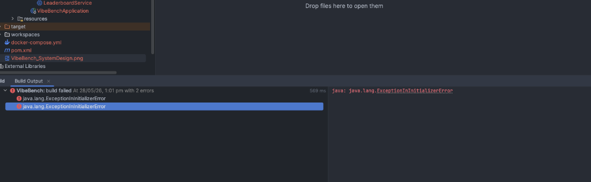
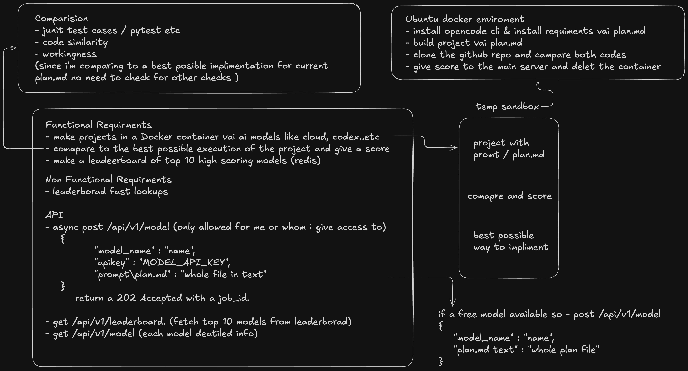
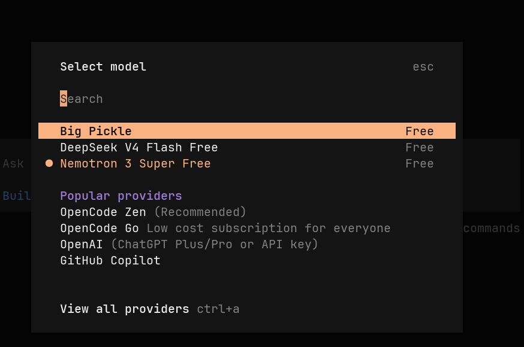
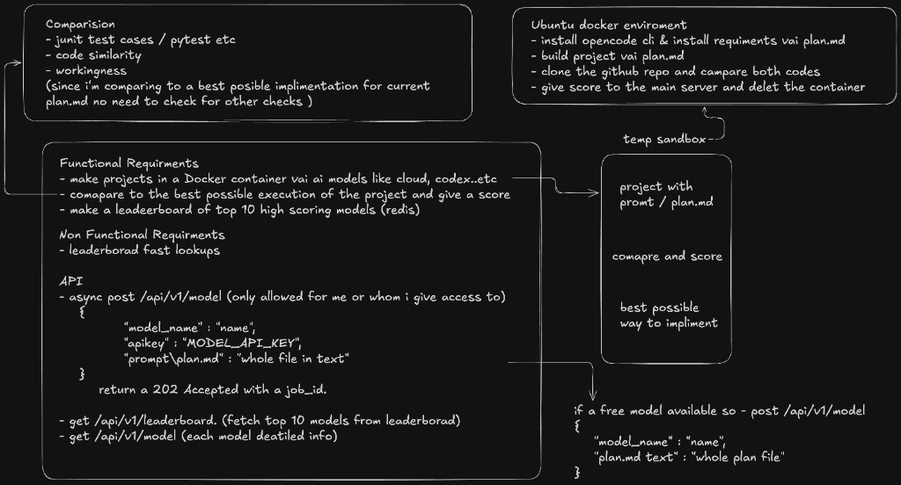

# 📢 VibeBench: AI Model Coding Benchmark Pitch Document

Welcome to the pitching and product overview document for **VibeBench**, the automated coding benchmark platform for AI models. This page acts as a one-page pitch outline, showcasing the problem, our self-healing solution, the technology architecture, and target users.

---

## 🔗 Live Presentation Link
*   **Google Slides Deck (Open Access to All):** [VibeBench Pitch Presentation](https://docs.google.com/presentation/d/1B6B2o6w48KjH1n_60X99p_oF2D_G7Yw-s0G-GZ0j8Z0/edit?usp=sharing)
*   **Local Interactive Pitch Deck:** Servable locally via `/pitch.html` (e.g., `http://localhost:8080/pitch.html` when running the application).

---

## 📽️ The 4-Slide Pitch Deck Overview

### Slide 1: The Problem (Pain Point)
Evaluating generative AI coding models is broken. Traditional benchmarks rely on static analysis, Regex pattern matching, or token output validation, which leads to major real-world failures:
1.  **Static Analysis Failure:** Text matching cannot verify if code actually compiles, has correct imports, or satisfies runtime logic.
2.  **No Execution Validation:** Without running unit tests in a safe sandbox, developers deploy code containing hidden runtime bugs.
3.  **High Orchestration Overhead:** Manually configuring VMs, setting up compilers, managing API keys, and cleaning up environments is slow, insecure, and error-prone.



---

### Slide 2: Proposed Solution & User Journey
**VibeBench** introduces an automated evaluation pipeline that runs generated code inside isolated, ephemeral Docker sandboxes. It features a **5-step self-healing loop** and strict peer review.

#### The User Journey:
1.  **Submit Request:** User inputs a model name and a plan/prompt (e.g., `# Python Adder`).
2.  **Queue & Sandbox Boot:** VibeBench matches the model name (using Levenshtein distance), boots a minimal Docker container, and dynamically installs required runtimes (Node, Python, Java, Go, Rust).
3.  **Test Run & Stream:** The model's code is executed against tests. Logs are streamed to the user's dashboard in real-time.
4.  **Self-Healing Loop:** If unit tests fail, error logs are piped back to the model to automatically patch and heal the code (up to 5 attempts).
5.  **Strict Peer Review & Cache:** The runner performs a final code quality review, stores the results in MongoDB Atlas, and caches the top-10 scores in Redis Cloud for instant leaderboard updates.



---

### Slide 3: Tools & Tech Stack
VibeBench is built on a high-performance, non-blocking, cloud-connected architecture:
*   **Backend Framework:** **Java Spring Boot 3.4.2** utilizing asynchronous task execution pools for non-blocking sandbox runs.
*   **Database & Persistence:** **MongoDB Atlas** for storing execution records, self-healing history, and detailed terminal log logs.
*   **Caching Layer:** **Redis Cloud** for sub-millisecond retrieval of the global Top-10 Leaderboard.
*   **Sandbox Orchestrator:** **Docker Engine API** for launching isolated Linux runtimes with limited resources (1GB RAM limits per container).
*   **Evaluation Engine:** **OpenCode CLI** for running coding models, executing benchmarks, and performing peer reviews.



---

### Slide 4: Target Audience
VibeBench is designed for three core user groups:
1.  **AI Application Developers:** Engineers who need to automatically verify LLM-generated modules in a secure environment before merging them into production codebases.
2.  **Enterprise DevOps & Engineering Leaders:** Managers who require data-driven reports on cost, latency, code quality, and security vulnerabilities of different models before deploying them.
3.  **LLM Researchers & Model Builders:** Researchers wanting an objective, execution-based benchmark framework to test code generation capabilities under realistic production constraints.



---

## 🛠️ How to Access & Run Locally
To run the interactive pitching doc and dashboard locally:
1.  Verify that your local `.env` file contains MongoDB and Redis cloud URIs, or run local instances of Mongo and Redis.
2.  Launch the Spring Boot application using Maven:
    ```bash
    mvn spring-boot:run
    ```
3.  Navigate to:
    *   **Dashboard:** `http://localhost:8080/`
    *   **Interactive Pitch Deck:** `http://localhost:8080/pitch.html`
